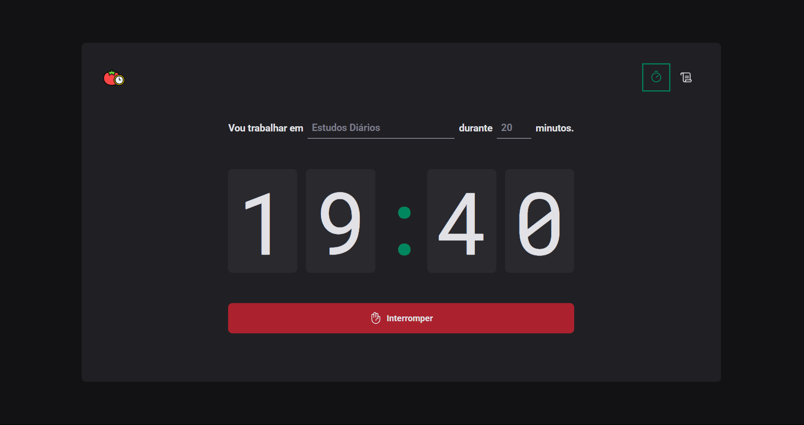
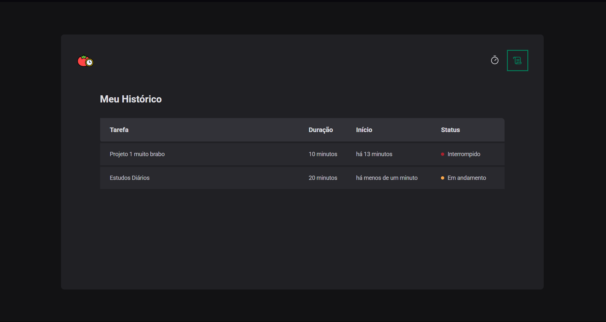

# 🍅🕜 Projetos de Aprimoramento nos conhecimentos em React e TypeScript

O projeto consiste em um `temporizador do método pomodoro` e o controle dos temporizadores anteriores. O projeto foi feito para aprendizado com base nos conteudos da rocketseat disponibilizados na internet. 
Nele foram utilizados os conceitos de componentização, rotas entre páginas, hooks do React, como useEffect, useState e o useReducer, uso do local storage. Além disso foi utilizado o typescript com styled components para a estilização da página.

## 💻 Demonstração

Veja como funciona: 




## ▶️ Como executar o projeto localmente

No seu terminal 

```bash
# Clone o repositório
git clone https://github.com/yVictorK/ProjetoPomodoro.git

# Acesse a pasta do projeto
cd ProjetoPomodoro

# Instale as dependências
npm install
# ou, se preferir usar yarn
yarn install

# Inicie o servidor de desenvolvimento
npm run dev
# ou
yarn dev

```

#ProjetoPomodoro


