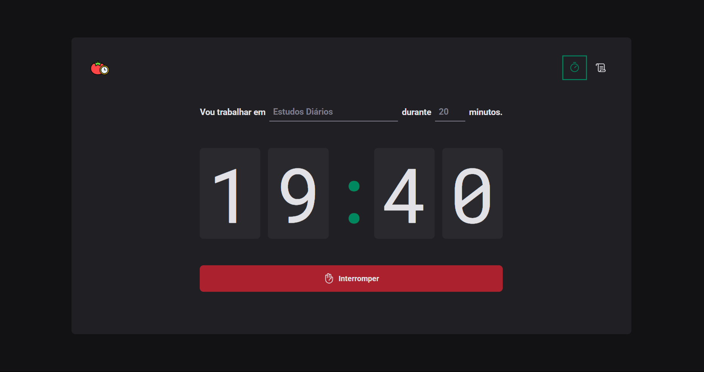
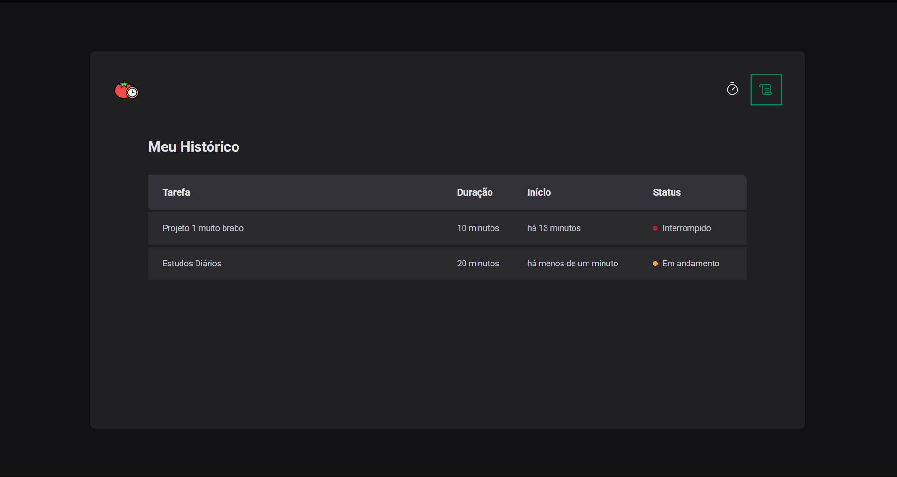

# Pomodoro Timer – React + TypeScript

A Pomodoro timer app built with React and TypeScript as a learning project. The app allows users to start Pomodoro cycles and track previously performed cycles through a historical view.

---

## Overview

This project was developed as part of a study process focused on improving skills in React and TypeScript. The application implements a Pomodoro timer that allows users to start work sessions and track previously executed cycles.

The project was built following educational content from Rocketseat and focuses on practicing modern React concepts such as component-based architecture, state management with hooks, routing between pages, and persistent state using LocalStorage.

The main goal of this project is to reinforce knowledge in React application structure, state handling, and TypeScript integration in a real interface.

---

## Features

- Pomodoro timer to manage focused work sessions
- History page showing previous cycles
- Component-based architecture
- Page navigation using React Router
- State management using React Hooks
- Persistent data using LocalStorage
- Styled UI using Styled Components
- Fully written in TypeScript

---

## Technologies Used

This project was developed using the following technologies:

- React
- TypeScript
- Styled Components
- React Router
- Vite
- LocalStorage API

---

## Key Concepts Practiced

During the development of this project, the following React concepts were explored:

- Componentization
- State management with `useState`
- Side effects using `useEffect`
- Complex state handling using `useReducer`
- Page routing
- Persistent data storage with LocalStorage
- Modular project structure
- Styling with Styled Components

---

## Demonstration

### Home Screen

<p align="center">
  
</p>

<p align="center">
  <em>Main interface where users can start a Pomodoro timer cycle.</em>
</p>

### History Screen

<p align="center">
  
</p>

<p align="center">
  <em>History page displaying previous Pomodoro cycles.</em>
</p>

---

## How to Run the Project Locally

### 1. Clone the repository

```bash
git clone https://github.com/yVictorK/ProjetoPomodoro.git
```

### 2. Navigate to the project folder

```bash
cd ProjetoPomodoro
```

### 3. Install dependencies

Using npm:

```bash
npm install
```

Or using yarn:

```bash
yarn install
```

### 4. Start the development server

Using npm:

```bash
npm run dev
```

Or using yarn:

```bash
yarn dev
```

After running the development server, open the address displayed in the terminal in your browser.

---

## Educational Purpose

This project was created as a learning exercise to improve knowledge in React and TypeScript development. It focuses on understanding how to structure a React application, manage state with hooks and reducers, and persist data in the browser.

---

## Author

Victor Kossmann

---
